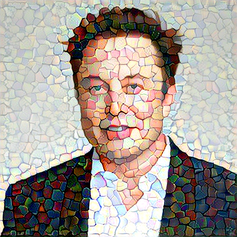
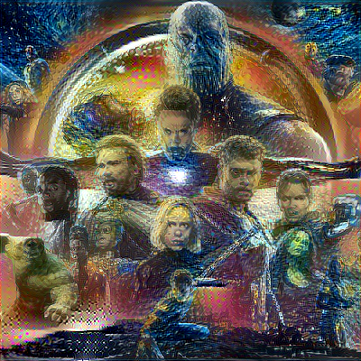
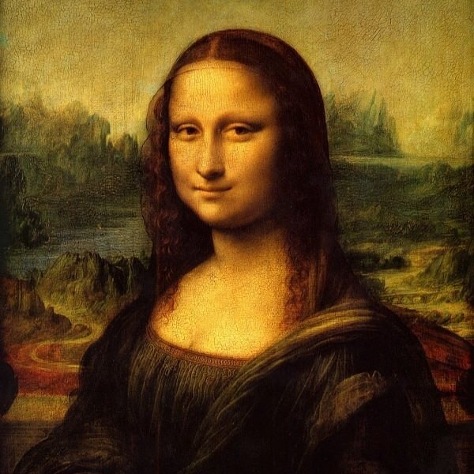
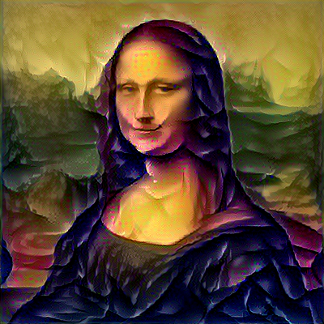

# Neural Style Transfer

This is the tf.keras implementation of Neural Style Transfer.

## Result

</img>

Original Image

</img>

Modified Image

</img>

MOdified Image

</img>

Original Image

</img>

Modified Image

</img>

Original Image

</img>

Modified Image

</img>

Original Image

</img>

MOdified Image